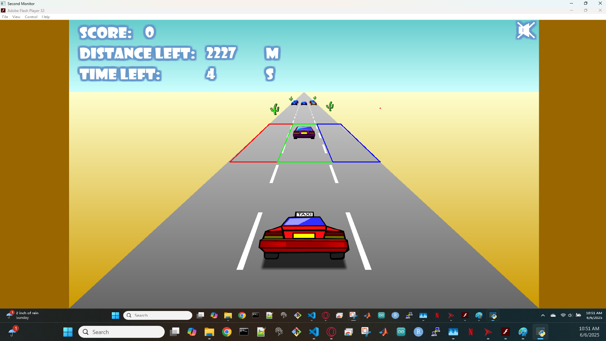

# TaxiGoneWild_RL
Using reinforcement learning to beat the flash game "Taxi Gone Wild"

Current implementation:

- Have set up screen capture via mss library.
- Defined regions for later use in RL - getting distance, time remaining, whether there's an obstacle, etc.
- Defined helper functions to control inputs via pyautogui.

ToDo:

- Set up training gym + rewards system for RL (obviously this is the main part, but ensuring the system has enough information to properly learn game mechanics is the most important part).
